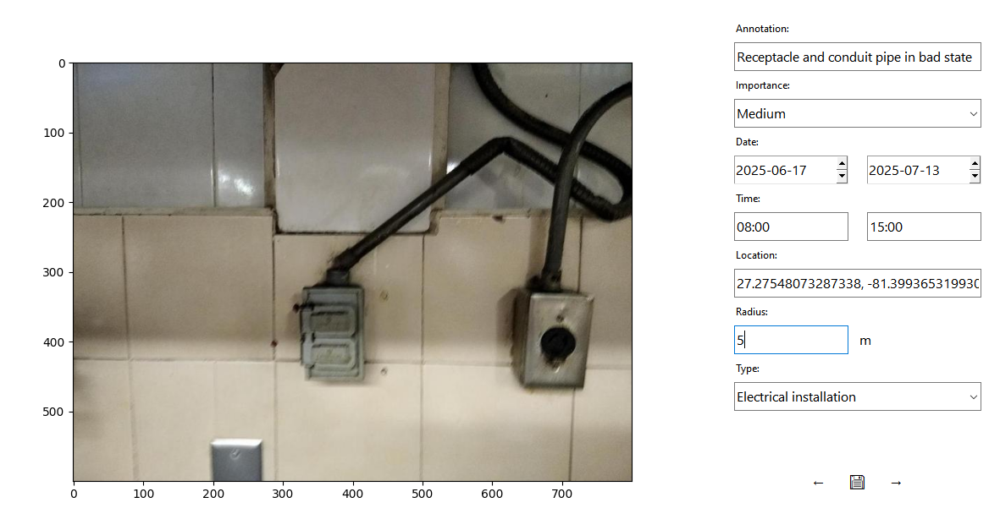
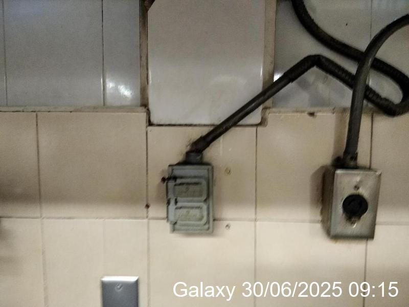
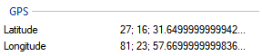

# Photo annotator

__Photo annotator__ is a program to edit pictures metadata and print date and hour data in a picture. It includes a GUI for ease of use

Features:

* Associate a description for each picture
* Classifies the pictures based on relevance and type
* Changes the picture date with a random date within a given date and hour range 
* Writes a random coordinate to the picture given the coordinate and the allowed radius.

> NOTE: If you want the coordinate to be exactly your input, input 0 in the allowed radius.

> It supports spanish (es), english (en) and chinese (zh) 

---
### Disclaimer

This program allows editing of photo metadata, including date, time, and location. The modifications produced are for personal or educational purposes only. The user is fully responsible for any use of altered metadata, particularly in contexts where accurate metadata is legally. The developer assumes no responsibility for misuse.

---

### Requirements

* random
* tkinter
* matplotlib
* datetime
* piexif
* math
* json
* configparser
* PIL

---
## Example

> Open `config.ini` and the following settings will be input.

* font= arial
* red= 255
* green= 255
* blue= 255
* phone= Galaxy
* lang= en

> Run `photo_annotator.py` and start using it.

> Choose the folder where the pictures you want to modify are in the file dialog.

> Choose the folder where you will save the cloned pictures in the file dialog.

> Input the data you desire to be written and also saved in a _photo_database.json_ file and click in the button with a 💾.



> You will see that the metadata and the database was written.




> In the database it was written the following

```
{
  "C:/Users/AVRG_USER/Documents/IMG_20240528_101247.jpg": {
    "note": "Receptacle and conduit pipe in bad state",
    "coordinates": [
      27.27548156872643,
      -81.399378674264
    ],
    "importance": "Medium",
    "date": "2025-06-30 09:15",
    "category": "Electrical installation"
  }
}
```
